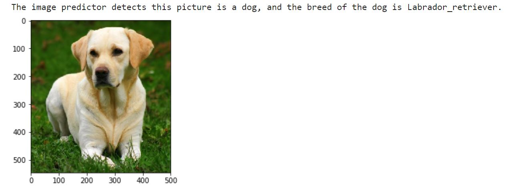
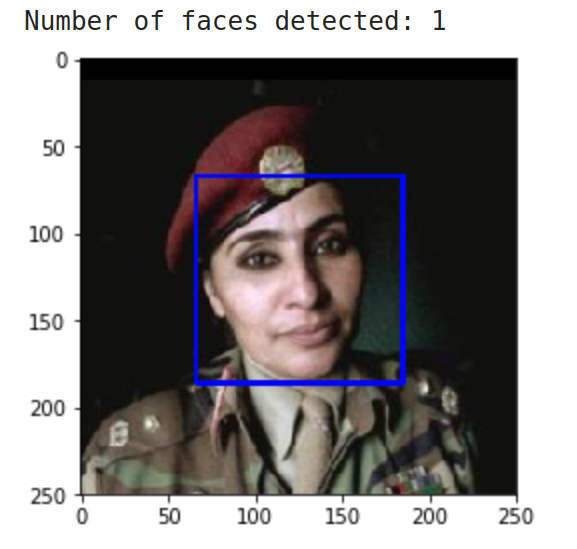
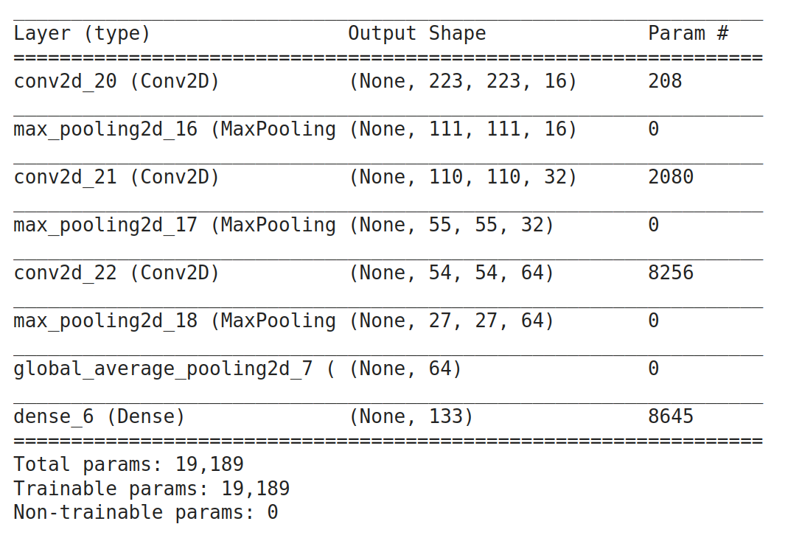
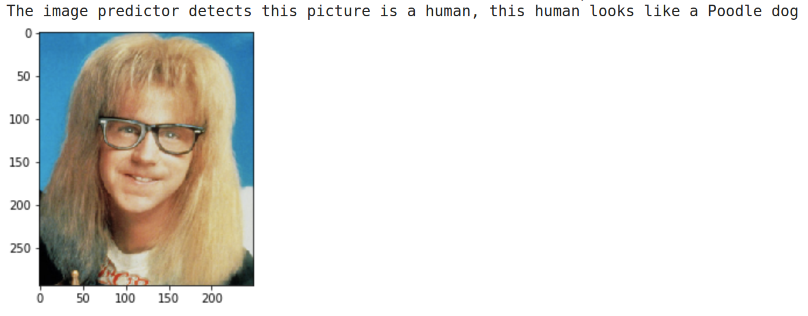
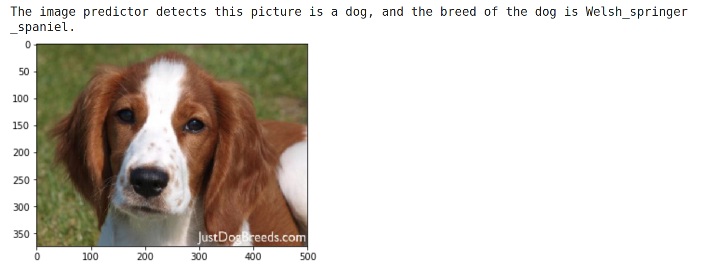
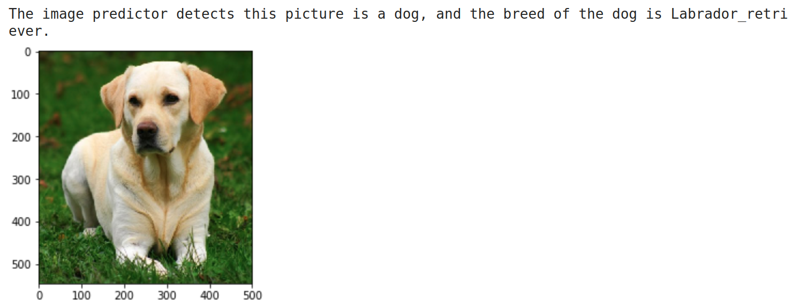

# Dog Breed Classification Project

### Introduction:

Dog Breed Classification Project is an AI project. This project uses deep learning to predict which dog breed a given image belongs to. Through the entire project, you can learn to use opencv's built-in predictors, build your own deep learning models, or reuse existing powerful models using the transfer learning method, will then combine them to create an algorithm for a **Dog Identification App**. All included in this project.



### Data

We use a **dog dataset** and a **human dataset** for this project. You can download it at the links below:

- [**Dog dataset**](https://s3-us-west-1.amazonaws.com/udacity-aind/dog-project/dogImages.zip)
  - There are 8351 total dog images
  - Classified into 133 total dog categories
- [**Human dataset**](https://s3-us-west-1.amazonaws.com/udacity-aind/dog-project/lfw.zip)
  - There are 13233 total human images. We only use the first 100 images in this dataset for the purpose of evaluating the accuracy of the models.

### Instructions:

> The entire content of the project is covered by [**Dog_app.ipynb**](https://github.com/lexuansanh/Dog-Breed-Classification-Project/blob/main/dog_app.ipynb) notebook

#### Prerequisites:

- Ability to use**python**.
- Know about Opencv, Keras, Matplotlib libraries.

#### Using Opencv's build-in model

- **Implement**:

  - Using `cv2.CascadeClassifier()` to make detector:
    `face_cascade = cv2.CascadeClassifier('haarcascades/haarcascade_frontalface_alt.xml')`
  - Using detectMultiScale() function to detect image (required input image is a grayscale image):
    `faces = face_cascade.detectMultiScale(image)`
- **Result**:

  

  > The model can predict well with the image of a human face, so if the input image is a dog, Will the model detect it?
  >
- **Evaluate** (with 100 images of dog dataset and 100 images of human dataset):

  - Percentage of the first 100 images in human_files have a detected human face: 100.00%
  - Percentage of the first 100 images in dog_files have a detected human face: 11.00%
- **Comment**:

  - The grayscale image prediction is a disadvantage, because it loses the characteristics of the color image.
  - Making predictions more difficult or confusing.
  - We can build a model with a color image input which will be much better.

#### Using CNN model:

> **CNN Model** is a convolutional neural network model is used in computer vision. You can see more information about CNN [**Here**](https://en.wikipedia.org/wiki/Convolutional_neural_network)

- **Implement**:

  - Using pre-trained Resnet50 model-The power model for image classification. This model is available in `keras.applications`
    `ResNet50_model = ResNet50(weights='imagenet')`
- **Evaluate** (with 100 images of dog dataset and 100 images of human dataset):

  - Percentage of the first 100 images in human_files have a detected dog: 0.00%
  - Percentage of the first 100 images in dog_files have a detected dog: 100.00%
- **Comment**:

  - The model uses the input image as a color image.
  - Achieved excellent results with respect to the evaluation data.

> So how do we build a similar model for our specific dog breed classification problem?

#### Making CNN model:

- **Define Input/Output**:

  - Input is color image with image shape (224,224.3). Where:
    - 224,224 are the height and width of the image, respectively.
    - 3 is the number of color channels of the image
  - Output is 133 classes corresponding to 133 dog breeds to predict.
- **Implement**:

  - Using `Sequential()` of `keras.models` to make a model:

  ```
  model = Sequential()
  # Layer 1: Conv2D with kernel_size = 2x2, fillers  = 16, activation = 'relu', input_shape = 224x224x3
  model.add(Conv2D(16, 2, strides=1, activation="relu", input_shape = (224, 224, 3)))

  # Layer 2: MaxPooling2D with pool_size = 2x2
  model.add(MaxPooling2D(2))

  # Layer 3: Conv2D with kernel_size = 2x2, fillers  = 32, activation = 'relu'
  model.add(Conv2D(32, 2, strides=1, activation="relu"))

  # Layer 4: MaxPooling2D with pool_size = 2x2
  model.add(MaxPooling2D(2))

  # Layer 5: Conv2D with kernel_size = 2x2, fillers  = 64, activation = 'relu'
  model.add(Conv2D(64, 2, strides=1, activation="relu"))

  # Layer 6: MaxPooling2D with pool_size = 2x2
  model.add(MaxPooling2D(2))

  # Layer 7: GlobalAveragePooling2D
  model.add(GlobalAveragePooling2D())
  model.add(Dense(133, activation = 'softmax'))
  ```

  - Model summary `model.summary()`
    
- **Comment**:

  - This is a simple example for building an image classification CNN model.
  - We can use the transfer learning method to reuse the results of previously trained powerful CNN models. Its benefits include:
    - Pre-train models have been shown to work very well with images because they have been trained on very large data sets.
    - Reduce the cost of training from the beginning of the network.

#### Using pre-trained Model:

> Resnet50 is a deep and powerful network for computer vision. So it is perfectly suitable for the current problem with a large number of classification classes.

- **Evaluate** (on 836 test dog images):
  - Load model:
    `Resnet50_model.load_weights('saved_models/weights.best.Resnet50.hdf5')`
  - predict on 836 test dog images and calculate accuracy.

> Test accuracy: 76.7943%

- **Comment**:
  - The model works relatively well with an accuracy of about 77% on the test set.
  - We can use other pre-trained models instead and evaluate looking for the model that gives the best results.
  - Customize the current model, using advanced methods of deep learning to improve accuracy.

### Algorithm for a Dog Identification App

> Combine 3 models: `face_cascade` model , CNN `ResNet50_model = ResNet50(weights='imagenet')` and transfer learning model `Resnet50_model.load_weights('saved_models/weights.best.Resnet50.hdf5')` model to build Dog Identification App. Specifically:
>
>> - If a dog is detected in the image, return the predicted breed.
>> - If a human is detected in the image, return the resembling dog breed.
>> - If neither is detected in the image, provide output that indicates an error.
>>

- **Test**







> *Awesome*, **Try it by your own**


### Blog:

See more analysis and discussion with me at blog: [Is it really hard to write an AI application? Come to Dog Identification App](https://medium.com/@xuansanh96/is-it-really-hard-to-write-an-ai-application-come-to-dog-identification-app-6788c2708f26)

### **License**

[MIT](https://github.com/lexuansanh)
